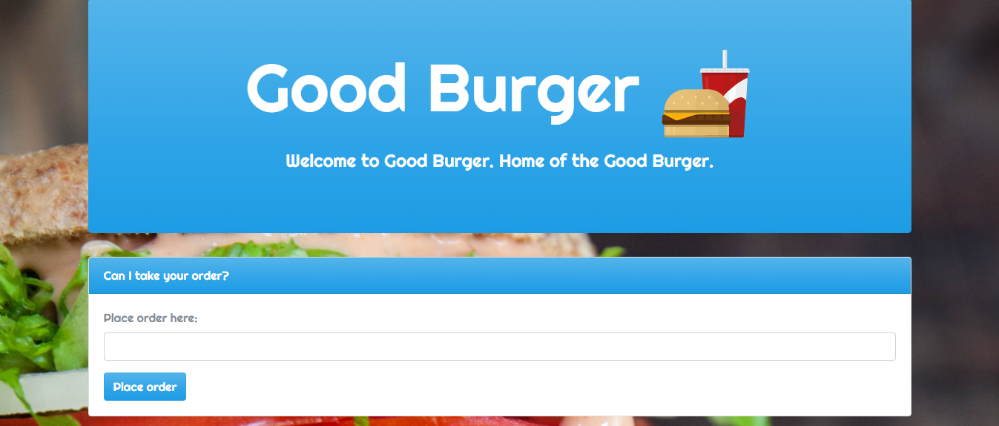

# Good Burger

## Table of contents
  * [Live](#live)
  * [Demo](#demo)
  * [About this project](#about-this-project)
  * [Getting started](#getting-started)
  * [Structure of the project](#project-structure)
  * [Screenshots](#screenshots)
  * [Technologies used to create app](#technologies-used)
  	* [Backend technologies](#Backend)
  	* [Frontend technologies](#Frontend)
  * [Design improvements](#design-improvements)
  * [Issues](#Issues)

## Live
https://gentle-caverns-56054.herokuapp.com/

##  Demo

##  About this project

##  Getting started

  1. [Step 1](#step-one)
  2. [Step 2](#step-two)
  3. [Step 3](#step-three)
  ...

###  Step 1

###  Step 2

###  Step 3

##  Structure of the project

##  Screenshots

### Welcome to Good Burger

 
 

### Burgers

### Devoured burgers

##  Technologies used to build app
In this section, list the technologies (backend and frontend) used during the project.
* [Backend technologies](#Backend)
* [Frontend technologies](#Frontend)

###  Backend technologies
* Node.js
* MySQL
* Express
* Express Handlebars

###  Frontend technologies
* HTML
* CSS
* Bootstrap
* Javascript

##  Design improvements

##  Issues

If you find an issue while using the app or have a request, <a href="https://github.com/philipstubbs13/burger/issues/" target="_blank">log the issue or request here</a>. These issues will be addressed in a future code update.
