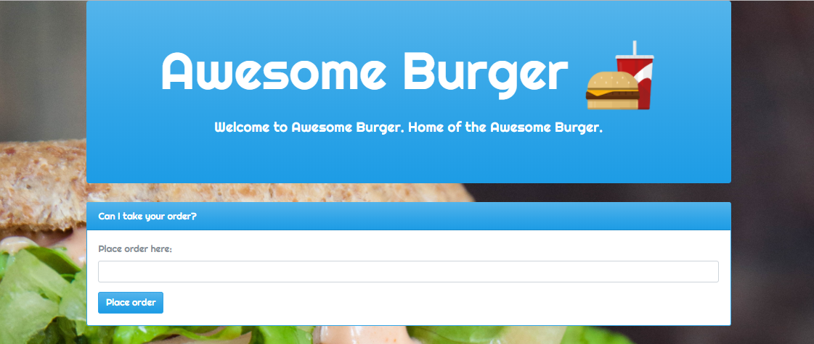
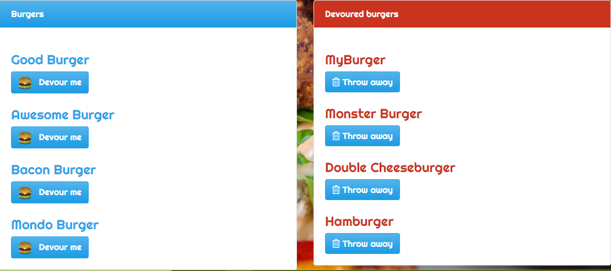
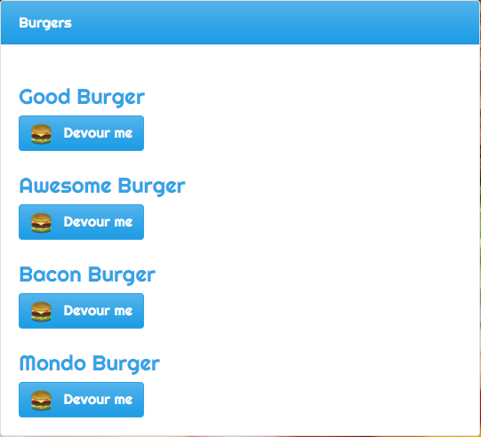
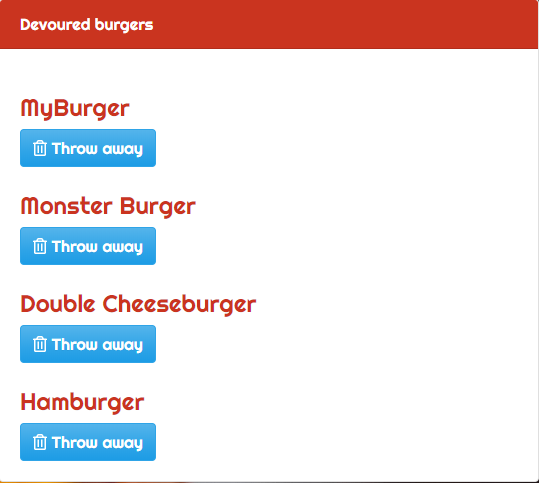

# Good Burger

## Table of contents
  * [Live](#live)
  * [About this project](#about-this-project)
  * [Getting started](#getting-started)
  * [Structure of the project](#project-structure)
  * [Screenshots](#screenshots)
  * [Technologies used to create app](#technologies-used)
  	* [Backend technologies](#Backend)
  	* [Frontend technologies](#Frontend)
  * [Design improvements](#design-improvements)
  * [Issues](#Issues)

## Live
https://gentle-caverns-56054.herokuapp.com/

##  About this project
This project is a full stack application that allows you to place an order for a burger. When you place an order, the burger you enter in the form field is added to the list of burgers on the left side of the screen. Each burger in the list has a <b>Devour me</b> button. Clicking this button moves the burger from the list on the left side of the screen to the list on the right. The list on the right is a list of burgers that have already been devoured. Each burger in this list has a <b>Throw away</b> button that allows you to remove the burger, which deletes the burger from the user interface as well as from the MySQL database. 

This project uses MySQL, Node, Express, Handlebars, and an ORM (Object Relational Mapper). Node and MySQL are used to query and route data in the application. Express is the core part of the backend of the application, and Handlebars is a templating language that is used to generate the HTML.

This project also follows the MVC (Model-View-Controller) design pattern. The MVC design pattern assigns objects in the application one of three roles (model, view, or controller) and defines the way the different parts of the application communicate with one another.

  * <b>View object:</b>
  A view object is an object in the application that is visible (in the user interface) to the end user of the application. The view displays data from the application's model and learns about any changes to the model data via the controller. For example, in this application, the user enters a burger name in a text field. The view communicates this user change via the controller to the model.

  * <b>Controller object:</b>
  A controller object controls the flow of data between the view and the model. The controller interprets any user changes made in the view and communicates the new or changed data to the model. Also, if the model were to change, the controller is what communicates the updated data to the view so that the user can see the new or updated data in the user interface.

  * <b>Model object:</b>
  A model object manages the data. When data is created or changed by the user in the view (for example, a user devours or deletes a burger), that change is communicated via the controller to the model. Also, when data is created or changed in the model, the model communicates that change via the controller to the view to display the new or updated data.

For more information about the MVC design pattern, check out this link for a high level overview: https://en.wikipedia.org/wiki/Model%E2%80%93view%E2%80%93controller

##  Getting started
To set up this application locally on your own computer, perform the following steps:
  1. [Clone the repository](#clone-repository)
  2. [Install Node.js](#install-node)
  3. [Install the dependencies](#dependencies)

###  Clone the repository
The first step is to clone the project repository to a local directory on your computer. To clone the repository, run the following commands:
<pre>
  git clone https://github.com/philipstubbs13/burger.git
  cd burger
</pre>

###  Install Node.js

If you don't already have Node.js installed on your computer, you can install the latest version here: https://nodejs.org/en/.

####  Structure of the project

After you clone the repository, navigate to the project root directory (burger). The project directory structure is set up as follows:

<ul>
  <li> 
    
<b>server.js</b>: This file does the following:

		<ul>
	    	<li>Defines and requires the dependencies, including express, body-parser, and express-handlebars.</li>
	    	 <li>Sets up the Express server.</li>
	    	 <li>Sets up the Express server to handle data parsing using body-parser.</li>
	    	 <li>Points the server to the API routes, which gives the server a map of how to respond when users visit or request data from various URLs.</li>
         <li>Defines the port the server is listening on.</li>
	    	 <li>Starts the server.</li>
         <li>Allows the app to serve static content from the public directory.</li>
    	</ul>
  <li>
    
<b>public</b>: Contains the static content (images, Javascript, and CSS). 

  </li>
  <li>
    
<b>models</b>: Contains a file called <b>burger.js</b>, which contains functions used to manage the application data and interact with the database.

    
The <b>burger.js</b> file also includes the code that will call the ORM functions using burger specific input for the ORM.

  </li>
  <li>
    
<b>db</b>: The database schema. The schema is what describes the structure of the database table, and the datatypes that each column of the table can contain. For this project, the database includes one table that includes columns for id, burger name, and devoured state (true or false).

  </li>
  <li>
    
<b>config</b>: Contains two files.
      <ul>
        <li><b>connection.js</b>: Contains the code to connect Node to MySQL.</li>
        <li><b>orm.js</b>: Contains the methods that will execute the necessary MySQL commands in the controllers. These methods are used to retrieve and store data in the database.</li>
      </ul>
  </li>
  <li>
    
<b>controllers</b>: Contains a file called <b>burgersController.js</b>, which contains different routes (GET, POST, PUT, and DELETE). These routes are used to pass information to and from the view and model objects.

  <li><b>views</b>: Contains the Handlebars files, which are templates used to generate the html files.</li>
  <li><b>package.json</b>: Lists the project dependencies (third party npm packages) and their version numbers.</li>
  <li><b>.gitignore</b>: Anything listed inside this file will not be tracked by GitHub when code is committed.</li>
  <li><b>package-lock.json</b>: Dependency tree for the project. Lists all the dependencies and their versions.</li>
</ul>

###  Install the dependencies

The following npm packages are dependencies to the project.

After you clone the repository to a local directory, change directory to the project root directory and run the following command to install the required npm packages:

<pre>npm install</pre>
<ul>
	<li><b>express</b> -  a Node.js web application framework (https://www.npmjs.com/package/express).</li>
	<li><b>body-parser</b> - used to parse incoming request bodies in a middleware. (https://www.npmjs.com/package/body-parser)</li>
	<li><b>dotenv</b> - used to retrieve the MySQL password from a .dotenv file(https://www.npmjs.com/package/dotenv).</li>
  <li><b>mysql</b> - used to create a connection to the MySQL database via the command line.(https://www.npmjs.com/package/mysql)</li>
  <li><b>express-handlebars</b> - allows you to use handlebars to create templates to build your HTML.</li>(https://www.npmjs.com/package/express-handlebars)</li>
</ul>

Version information for each of these packages is available in the package.json file in the project root directory.

##  Screenshots

### Welcome to Good Burger

 
 

### Burgers

### Devoured burgers

##  Technologies used to build app
* [Backend technologies](#Backend)
* [Frontend technologies](#Frontend)

###  Backend technologies
* Node.js
* MySQL
* Express
* Express Handlebars

###  Frontend technologies
* HTML
* CSS
* Bootstrap
* Javascript/jQuery

##  Design improvements
* Add a form field that allows users to provide their name with the burger they ordered.
* Allow users to update a burger's name after it is created.
* Add form validation so that the user can't submit an empty form (burger_name is null);

##  Issues

If you find an issue while using the app or have a request, <a href="https://github.com/philipstubbs13/burger/issues/" target="_blank">log the issue or request here</a>. These issues will be addressed in a future code update.
